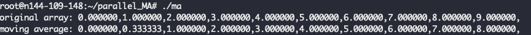
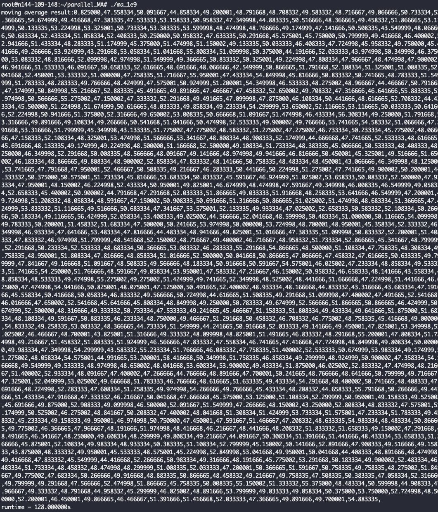
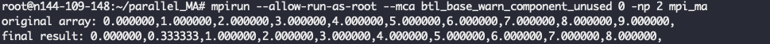
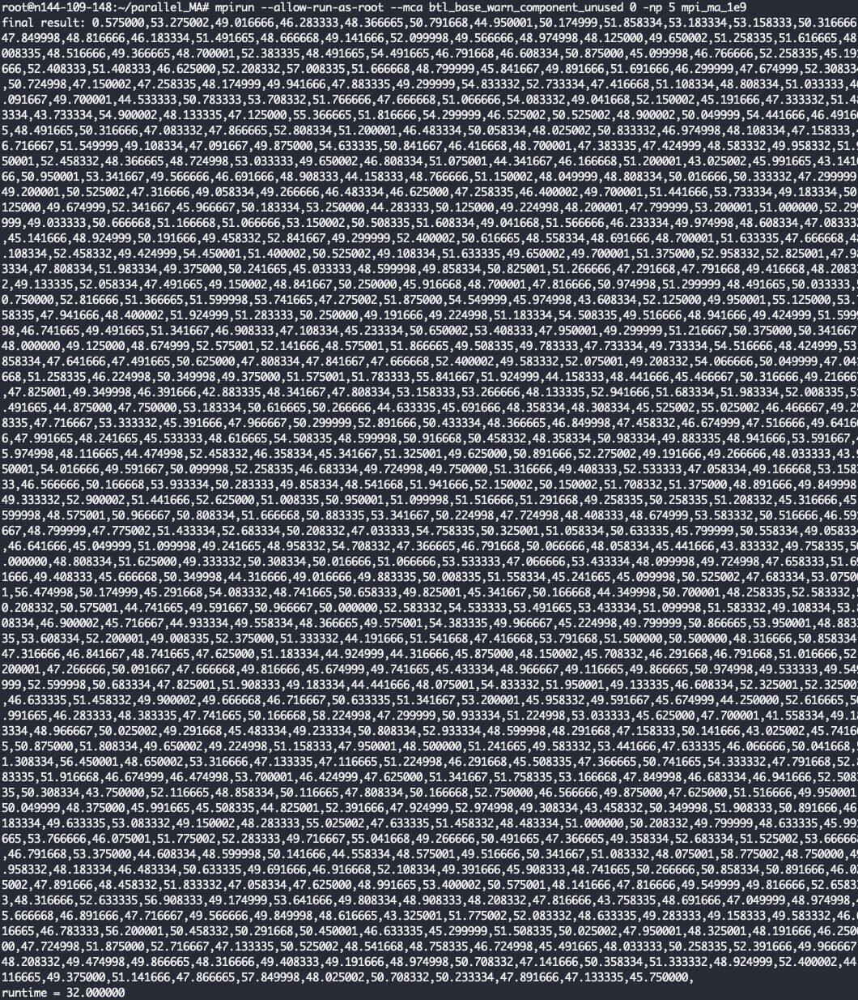
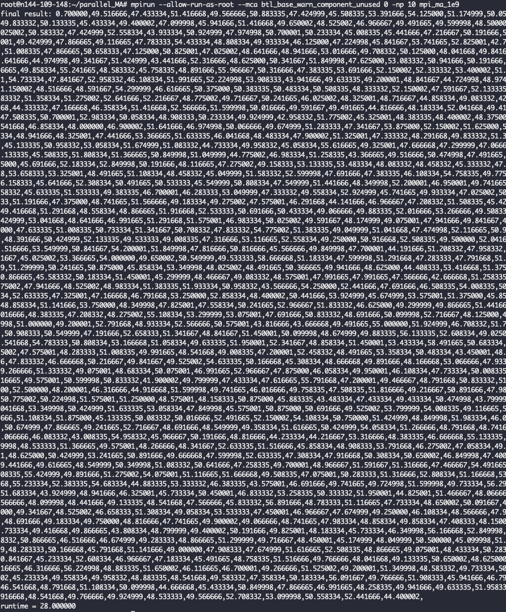

# parallel_MA
A parallel speed up of moving average operator with MPI

## Prerequisites
- Linux c/c++ 开发环境
- 安装open_mpi，可参考：https://www.open-mpi.org/faq/?category=building

## General Moving Average
一个c版本moving average的简单实现，分为小数据量和大数据量两个运行版本：
 ```shell
 # 小数量级版本
 $ gcc ma.c -o ma
 $ ./ma
 # 大数量级版本
 $ gcc ma_1e9.c -o ma_1e9
 $ ./ma_1e9
 ```

## Moving Average with MPI
利用Scartter与Gather实现分布式moving average，分为小数据量和大数据量两个运行版本：
 ```shell
 # 小数量级版本
 $ mpicc mpi_ma.c -o mpi_ma
 $ mpirun --allow-run-as-root --mca btl_base_warn_component_unused 0 -np 2 mpi_ma 
 # 大数量级版本
 $ mpicc mpi_ma_1e9.c -o mpi_ma_1e9
 $ mpirun --allow-run-as-root --mca btl_base_warn_component_unused 0 -np 10 mpi_ma_1e9 
 ```

## Performance
### 单机版Moving Average
- 小数量级验证

- 大数量级性能： 128s


### MPI版Moving Average
- 小数量级验证

- 大数量级性能： 
1. 5并发性能：32s

2. 10并发性能：28s


## TODO
由于边界条件的处理导致并发越大边界收益月底，需要进一步优化。即解决pooling窗口重叠问题的性能优化。